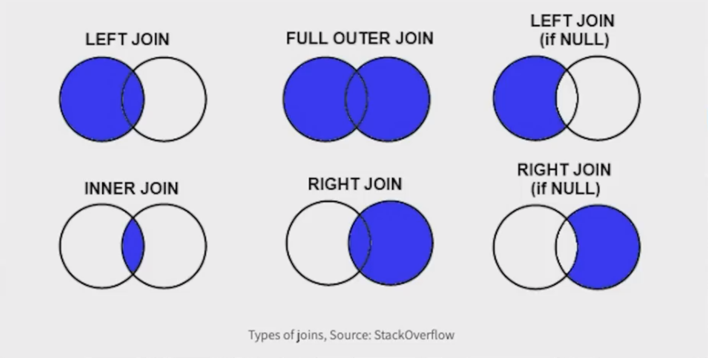

# Learning ETL pipline with Pyhton PANDAS
[Youtube Corse I followed](https://www.youtube.com/watch?v=2uvysYbKdjM)
[Git repo of the course and Databases](https://github.com/KeithGalli/complete-pandas-tutorial)

## Cheat sheet 
[pandas cheat sheet](pandas-cheat-sheet.md.html)
